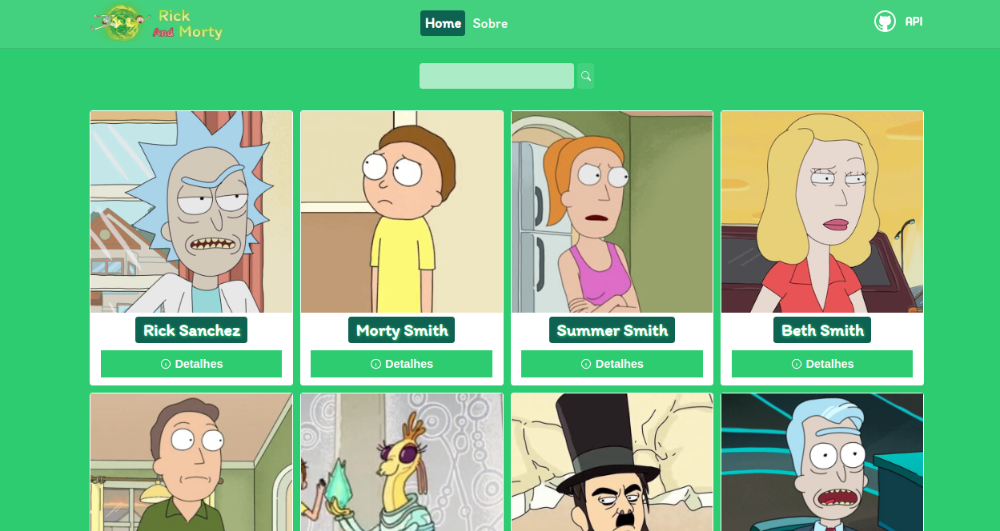

# Rick and Morty

## Descrição

### O que é rick and Morty?

    Rick and Morty é uma animação da <b>Cartoon Network</b>, que mostra a história de um avó (Rick) e seu neto (Morty)   que fazem diversas viagens tempo-espaço e por universos paralelos.

### Qual o intuito da aplicação?

    O intuito da aplicação é exibir informações sobre a animação, como, por exemplo, listar todos os personagens existentes na animação.   Na aplicação também é possível ver os detalhes de cada personagem, como, sua <b>espécie</b>, seu <b>gênero</b> e seu <b>status atual</b>.

    A aplicação também tem a funcionalidade <b>busca</b>, com ela você pode digitar o nome de um personagem ou apenas um termo,   com isso será <b>listado</b> todos os personagens que tem esse nome ou contém esse termo.

### Qual a API utilizada?

    A aplicação utiliza a API do <b>RickAndMortyAPI</b> para buscar as informações disponibilizadas no site, a API é feita no formato REST e GraphQL.

## Ferramentas

Ferramentas utilizadas no desenvolvimento.

ReactJs  
[@ReactJs](https://www.npmjs.com/package/@reactjs)

TypeScript  
[@TypeScript](https://www.typescriptlang.org/)

Styled Components  
[@Styled-Components](https://styled-components.com/)

API do RickAndMorty  
[@RickAndMortyAPI](https://rickandmortyapi.com/documentation/)
